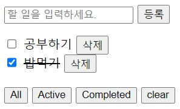

## Javascript로 todolist 만들기



<br>

### 폴더 구조

```
├── index.html
└── src
    ├── App.js              # main에서 App 컴포넌트를 마운트한다.
    ├── main.js             # js의 entry 포인트
    ├── components          # Component 역할을하는 것들
    │   ├── ItemFilter.js
    │   ├── ItemInput.js
    │   └── Items.js
    └── core                # 구현에 필요한 코어
        └── Component.js
```

### 기능

- 할일 추가
- 할일 진행 or 완료(토글버튼)
- 할일 삭제
- 할일 필터링
- 할일 전체 삭제

### 참고

[javascript로 웹 컴포넌트 만들기](https://junilhwang.github.io/TIL/Javascript/Design/Vanilla-JS-Component/#_1-%E1%84%80%E1%85%B5%E1%84%82%E1%85%B3%E1%86%BC-%E1%84%8E%E1%85%AE%E1%84%80%E1%85%A1)

[class](https://ko.javascript.info/class)

[Event delegation](https://ko.javascript.info/event-delegation)

[this](https://poiemaweb.com/js-this)
